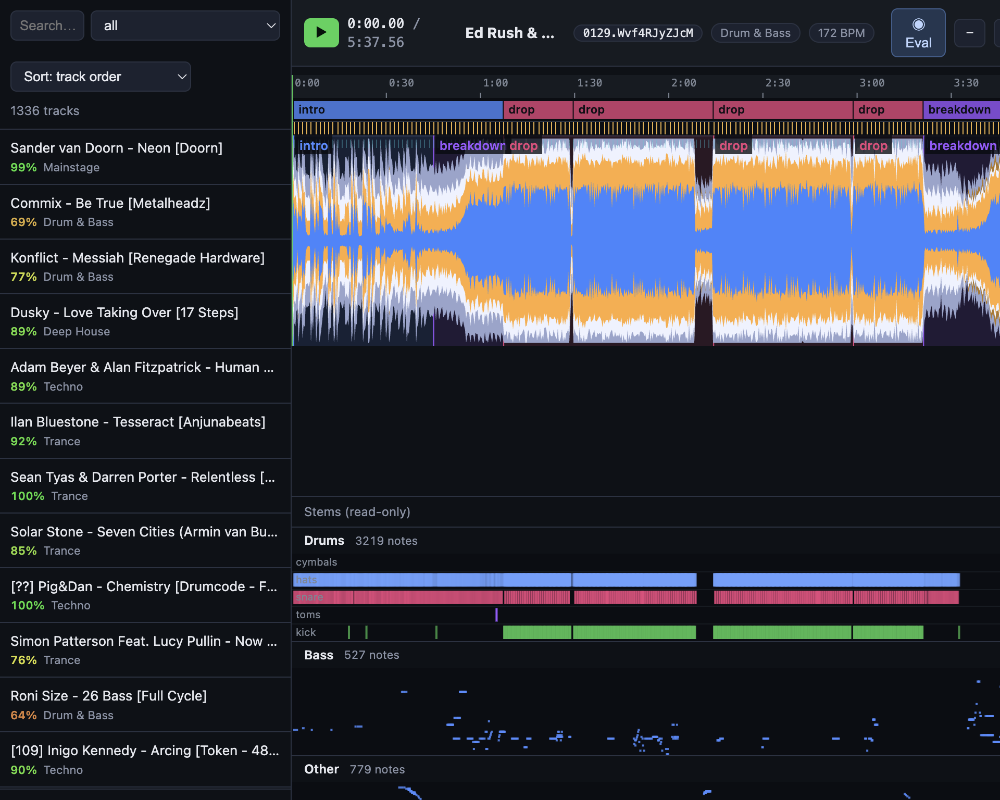

# jams

On-demand **music-information-retrieval API** for DJ / electronic music. Point it at a
track and get its **key**, **tempo**, and (optionally) **song structure** — using the
SOTA-on-GiantSteps methods benchmarked in the companion eval harness.

| Analysis | Method | Accuracy (GiantSteps) |
|----------|--------|-----------------------|
| Key | **24-class key CNN (ours, MIT — K10)** | MIREX **0.832** / exact **0.780** (honest protocol) |
| Tempo | **256-class tempo CNN (ours, MIT — TP1)** + genre-aware octave resolution | Acc1 **0.967** (corrected labels, n=458) |
| Structure | **All-In-One EDM ensemble on-device** (Apple-Silicon/MPS) | Raveform held-out CV reproduces SOTA (see `eval/`) |
| Stems → MIDI | **SCNet XL IHF** 4-stem split + per-stem transcription (**YourMT3+**; **our drum CRNN, MIT — D1** → General MIDI) | Slakh test **e2e** (mix→MIDI): other **0.79** / bass 0.66 note-F, 14.3 dB drums SI-SDR; drums onset-F **0.767** Slakh-oracle / **0.818** E-GMD (see `eval/`) |

There are deliberately **no silent fallbacks**: a broken install raises a clear error
instead of quietly degrading accuracy (the old librosa fallback cost ~19 pt MIREX on key
and ~13 pt Acc1 on tempo). Key and tempo run our own bundled CNNs in self-contained uv
workers.

Everything the API produces is inspectable in the bundled annotator webapp:

<p align="center">
  
</p>

## Requirements

- **Python 3.13** — pinned in `.python-version`, so `uv` picks it automatically.
- `uv` (https://docs.astral.sh/uv).
- The key, tempo, and drum CNN weights are bundled (`src/jams/data/models/*.pt`); no download.
- `ffmpeg` on PATH for mp3/m4a decoding (librosa/audioread).

## Quickstart

```sh
uv sync                       # install
uv run jams                   # serve on http://0.0.0.0:8000  (Swagger at /docs)
```

Or bring up the whole local stack — the jams API plus the **annotator webapp**
(waveform editor for beat/structure annotations, see [`webapp/README.md`](webapp/README.md)) —
with one command:

```sh
./scripts/dev.sh              # installs all deps, runs jams API (:8000) + annotator
                              # API (:8787) + frontend (:5173), opens the browser
```

### Analyze your own tracks in the browser

The whole loop is one command + one webpage:

```sh
./scripts/dev.sh              # then: drag any audio file onto http://localhost:5173
```

Drop a `wav` / `mp3` / `flac` / `aiff` / `ogg` / `m4a` / `aac` anywhere in the annotator
window. Under the hood the file is uploaded to the annotator server, run through the jams
API (key, tempo, beats/downbeats, structure, stems), and registered as a new track
(`import.<name>`) with the audio and analysis stored alongside the dataset — it opens in
the editor with the waveform, beat grid, and section labels ready to inspect or correct.
Full analysis runs on-device; expect roughly 30–90 s per track on Apple Silicon.

Stem separation + per-stem MIDI transcription (the piano-roll lanes under the waveform)
runs by default and is by far the slowest stage — the first import additionally downloads
model checkpoints (YourMT3+ clones via git-lfs; the SCNet and drum-CNN worker envs resolve
through uv), so budget several minutes the first time. The **Transcribe stems on import**
checkbox at the bottom of the track list skips it.

If the analysis found too few (or too many) sections for your taste, use the **Sections**
slider in the right-hand inspector: it re-thresholds the cached boundary activations from
the analysis instantly (no re-run), and ⌘Z restores the previous segments. Available for
imported tracks up to 10 minutes (longer tracks are analyzed in chunks, which don't keep
activations).

Analyze an upload:

```sh
curl -s -F file=@track.wav -F genre="Drum & Bass" http://localhost:8000/v1/analyze | jq
```

Analyze a file already on the server (e.g. your local library):

```sh
curl -s http://localhost:8000/v1/analyze/path \
  -H 'content-type: application/json' \
  -d '{"path": "/Users/me/Music/track.wav", "genre": "Dubstep"}' | jq
```

Example response:

```json
{
  "filename": "track.wav",
  "duration_sec": 124.0,
  "key": {"key": "F minor", "tonic": "F", "mode": "minor", "confidence": 0.81, "method": "key-cnn-v1"},
  "tempo": {"bpm": 174.0, "bpm_raw": 87.0, "bpm_alt": 87.0, "octave_resolved": true, "method": "tempo-cnn-v1"}
}
```

## Tempo octave resolution (the DJ-critical bit)

Tempo trackers get the BPM *value* right but can be an octave off (half/double-time) —
the error concentrates in **Drum & Bass** and **Dubstep**. Pass a `genre` (or explicit
`bpm_min`/`bpm_max`) and the result is folded into that genre's canonical octave. D&B and
jungle resolve to **full tempo (~174)**, not half-time. `bpm_alt` always returns the
other octave so a client can flip it. With no hint, the raw value is returned unchanged
(nothing is silently folded).

## Key detection (our CNN)

Key comes from our own **24-class key CNN** (K10 — MIT weights, ~0.1 M params, bundled at
`src/jams/data/models/key_cnn_v1.pt`, run in-process — `src/jams/analysis/key_cnn.py`).
Log-CQT input, pitch-shift augmentation, trained on the public Beatport corpus underlying
GiantSteps-MTG-Keys.

**Honest protocol** (the literature standard): train only on **GiantSteps-MTG-Keys**-side
data, evaluate once on **GiantSteps Key** — one pre-registered shot per system.

| system | MIREX weighted | exact |
|--------|---------------:|------:|
| edma raw | 0.759 | 0.688 |
| S-KEY standalone | 0.817 | 0.748 |
| edma + S-KEY fusion (retired) | 0.812 | 0.757 |
| **key CNN (shipped)** | **0.832** | **0.780** |

Honest published SOTA on GiantSteps Key is ~0.76 weighted (Korzeniowski 74.6,
InceptionKeyNet 75.7, KeyMyna 75.9) — every row above clears it. The retired fusion
system's heads remain at `src/jams/data/key_fusion.json` for reproducing the baseline
rows via `eval/stats_significance.py`; it no longer runs in the service.

## Song structure (on-device)

Structure (beats / downbeats / **functional segments** — intro/buildup/drop/breakdown/…) comes
from **All-In-One** (Kim & Nam, WASPAA 2023). By default it runs the **EDM-trained `all-all`
8-fold ensemble locally on Apple Silicon** via PyTorch-MPS — no Replicate, no network, no
per-call cost. The EDM weights live on the same HuggingFace repo as the stock model and load via
a state-dict remap (no retraining). Because All-In-One's pinned torch/natten/demucs stack
conflicts with jams' env, the worker `src/jams/data/structure_worker.py`
is a **self-contained `uv` script** that bootstraps its own environment; jams launches it once
and keeps the models resident. **Requirement:** `uv` on PATH and an Apple-Silicon Mac. Structure
is opt-in per request (`structure=true`).

On Raveform's held-out 8-fold CV this reproduces the paper's SOTA (beat 0.978 / downbeat 0.964 /
boundary HR 0.755 / pairwise 0.825), and the production ensemble is more robust still — see
`eval/README.md`.

`target_bpm` (jams' octave-resolved tempo, fed automatically when you request `tempo` + `structure`)
is a *secondary* octave-correction safety net: it post-hoc rescales the beat grid only on a clean
half/double-time read. The EDM model already tracks D&B/dubstep at the right octave, so it's
usually a no-op — but harmless. (The earlier `±1 BPM` DBN-constraint approach was removed; it
crippled beat-F.)

Prefer the hosted model? Set `JAMS_STRUCTURE_BACKEND=replicate` (+ a Replicate token) to use
the original `jhurliman/allinone-targetbpm` endpoint instead.

## Stems → MIDI (on-device)

Opt-in per request (`stems=true`): split a track into 4 stems (**drums / bass / other /
vocals**) with **SCNet XL IHF** (vendored, MIT; A/B-selected on Slakh — see table), then
transcribe each to MIDI —

- **pitched stems (bass / other / vocals)** → **YourMT3+** (default; Chang et al., MLSP
  2024, via the MIT `mt3-infer` toolkit with Apache-2.0 weights — the GPL upstream repo is
  not used). Slakh-test oracle note-F: bass **0.849**, other **0.849** vs basic-pitch's
  0.789 / 0.490; full **mix→MIDI e2e**: other **0.788** / bass 0.661 — the e2e system beats
  basic-pitch's ground-truth-stem ceiling on polyphonic accompaniment.
  `JAMS_STEMS_TRANSCRIBER=basic-pitch` selects the lighter transcriber.
  Bass/vocals get a shared monophonic post-filter; bass is shifted +12 to the written-MIDI
  convention in the orchestrator (validated for both transcribers). **First-run
  requirement: `git-lfs`** (the YourMT3 checkpoint clones from Hugging Face, ~536 MB).
- **drums** → **our own 5-class drum CRNN** (D1 — MIT weights, ~1.5 M params, bundled at
  `src/jams/data/models/drum_cnn_v1.pt`; trained on E-GMD + Slakh oracle/separated drum
  stems, with a real per-hit velocity head) → General MIDI percussion on channel 10
  (36 kick, 38 snare, 42 hats, 47 toms, 49 cymbals), quantized to jams' beat grid.
  One-shot gate vs the previous ADTOF-pytorch port (both arms superior): Slakh-test
  oracle macro onset-F **0.767** vs 0.638, E-GMD test **0.818** vs 0.645.

Output is one `.mid` per stem plus a combined Type-1 multitrack `.mid`, and inline note arrays.
Beat-grid quantization (`JAMS_STEMS_QUANTIZE`, default on) is a *stylistic* choice for
DAW-ready MIDI, not an accuracy feature — a ground-truth-beats ablation measured it at
−0.3 to −2.5 pt note-F versus raw model timing, so the eval harness scores unquantized.
Like structure, the heavy models run in self-contained `uv` workers (their pinned
demucs/basic-pitch stacks conflict with jams' env), kept resident: `src/jams/data/stems_worker.py` (separation +
pitched) and `drum_worker.py` (drums, our own bundled CNN weights). The orchestrator
(`analysis/stems.py` + `analysis/gm.py`) merges them and assembles the MIDI.

**Separation backend** (`JAMS_STEMS_MODEL`, default `scnet_xl_ihf`) — A/B on the Slakh
test split (151 tracks, through-separation scoring):

| backend | SI-SDR drums/other/bass (dB) | bass note-F | other note-F | drums onset-F |
|---|---|---:|---:|---:|
| **SCNet XL IHF** (default) | **14.3 / 11.8 / 6.0** | **0.645** | **0.473** | 0.574 |
| htdemucs | 11.6 / 10.1 / 4.6 | 0.596 | 0.459 | 0.585 |
| BS Roformer 4-stem | 13.1 / 8.6 / 5.7 | 0.628 | 0.468 | **0.596** |

`htdemucs` / `htdemucs_ft` remain selectable. Drums transcription slightly preferred the
Demucs-family stems in that A/B (measured with the previous ADTOF port) — a per-stem hybrid
(SCNet pitched + htdemucs drums) is future work.

**Platform:** fully cross-platform — separation auto-selects cuda → mps → cpu, and both
transcribers are torch/ONNX, so the whole pipeline (drums included) runs on Apple-Silicon
Macs, Linux, and CI identically. Config: `JAMS_STEMS_MODEL`, `JAMS_STEMS_TRANSCRIBER`, `JAMS_STEMS_QUANTIZE`,
`JAMS_STEMS_OUT_DIR`, `JAMS_STEMS_UV`. See `eval/README.md` for the transcription benchmark.

## Endpoints

| Method | Path | Purpose |
|--------|------|---------|
| `POST` | `/v1/analyze` | Multipart upload (`file`, `key`, `tempo`, `structure`, `genre`, `bpm_min`, `bpm_max`) |
| `POST` | `/v1/analyze/path` | JSON body with a server-side `path` + the same options |
| `GET`  | `/health` | Liveness + version |
| `GET`  | `/docs` | OpenAPI / Swagger UI |

Add **`?format=jams`** to either analyze endpoint to get the result as a
[JAMS](https://jams.readthedocs.io) document (the standard MIR annotation format the
Harmonix Set ships in) instead of the native schema: key → `key_mode`, tempo → `tempo`,
structure → `beat` + `segment_open`, each with per-observation `time`/`duration`/`confidence`
and `annotation_metadata` provenance (the producing `method` lands in `annotation_tools`).

```sh
curl -s 'http://localhost:8000/v1/analyze/path?format=jams' \
  -H 'content-type: application/json' \
  -d '{"path": "/Users/me/Music/track.wav", "structure": true, "genre": "Drum & Bass"}' | jq
```

## Configuration

Env vars (prefix `JAMS_`, or a local `.env`): `JAMS_HOST`, `JAMS_PORT`, `JAMS_LOG_LEVEL`,
`JAMS_MAX_UPLOAD_MB`. Structure backend: `JAMS_STRUCTURE_BACKEND` (`local` default | `replicate`),
`JAMS_STRUCTURE_MODEL` (`all-all` EDM ensemble default; `harmonix-all` for pop), `JAMS_STRUCTURE_UV` (path to `uv` if not on
PATH); the `replicate` backend needs `JAMS_REPLICATE_API_TOKEN` (or `REPLICATE_API_TOKEN`) and
`pip install 'jams[structure]'`.

## Develop

```sh
uv sync --all-extras --dev
uv run pytest          # tempo-resolution tests are pure; API tests use real analysis
uv run ruff check src tests
uv run mypy src
```

## Reproduce / push the accuracy

The `eval/` harness benchmarks the production functions against GiantSteps and is how the
numbers above were measured. Run in the project env with the `eval` extra:

```sh
uv run --extra eval eval/acquire_dataset.py   # download GiantSteps Key (~816 MB audio, one time)
uv run --extra eval eval/evaluate.py          # key MIREX + tempo Acc1/Acc2
uv run --extra eval eval/analyze_errors.py    # where the errors are, by genre/mode/octave
```

See `eval/README.md` for the method shoot-outs, the wrong-label story, and the curated
`tempo_corrections.csv`.

### Experiment tracking (MLflow)

**MLflow is the experiment system of record** (paper/EXPERIMENTS.md is the narrative twin).
The server runs on the aleph0 GPU box in Docker (container `mlflow`, storage
`/mnt/d/jams/mlflow/`, sqlite backend). Reach the UI through the tailnet:

```sh
ssh -N -L 127.0.0.1:5566:localhost:5000 -p 2222 jhurliman@aleph0.mole-acoustic.ts.net &
open http://localhost:5566        # local port 5566 — macOS AirPlay squats on 5000
```

(`aleph0.local` works as the host when on the same LAN.) Three pieces feed it:

- **Direct logging** — the structure trainer (`~/all-in-one` on aleph0) logs every run to
  experiment `raveform-structure` via lightning's `MLFlowLogger` (`MLFLOW_TRACKING_URI`,
  default `http://localhost:5000` on the box; startup **raises** if the server is down —
  no silent fallback).
- **wandb-offline sync** — `~/wandb2mlflow.py` (daemon on aleph0) mirrors the full metric
  history of pre-patch wandb-offline runs, plus GPU util/mem and the training log as an
  artifact, every 5 min. Restart: `nohup ~/mlflow_venv/bin/python ~/wandb2mlflow.py >
  ~/wandb2mlflow.log 2>&1 &`. Server restart: `docker start mlflow`.
- **Ledger backfill** — `uv run --extra eval eval/mlflow_backfill.py` loads every
  paper/EXPERIMENTS.md entry (key / transcription / separation) as a tagged MLflow run;
  idempotent by `ledger_id` tag.

## Layout

```
src/jams/
  analysis/   key.py · tempo.py · structure.py · audio.py   (the MIR core)
  analysis/   key_cnn.py · tempo_cnn.py                     (in-process CNN inference)
  api/        app.py · routes.py                            (FastAPI)
  models.py   pydantic schemas
  config.py   settings
  data/models/key_cnn_v1.pt · tempo_cnn_v1.pt · drum_cnn_v1.pt  (bundled CNN weights, MIT)
  data/stems_worker.py · drum_worker.py                      (self-contained uv workers: stems→MIDI)
  data/structure_worker.py                                   (self-contained uv worker: All-In-One)
```
